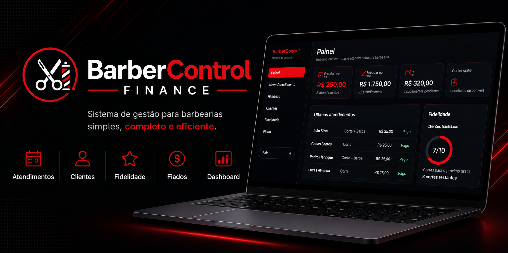
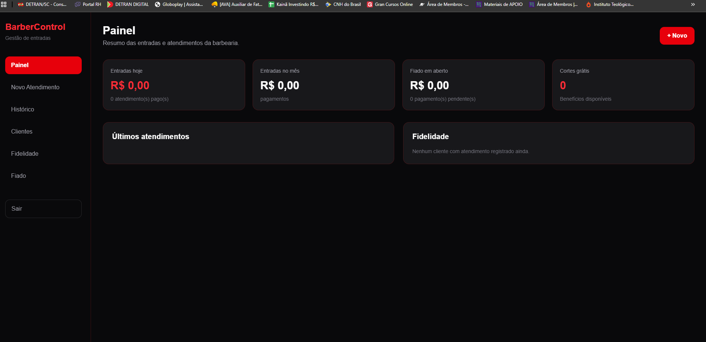
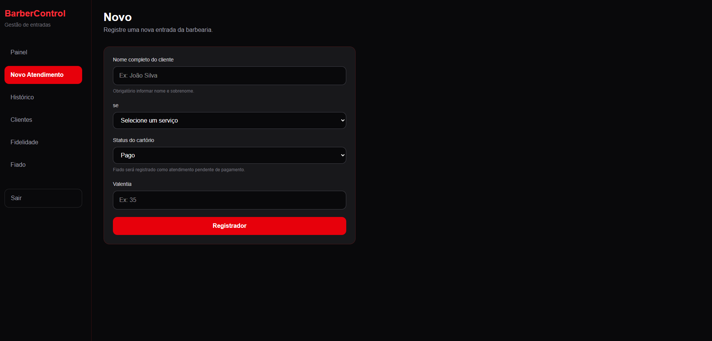
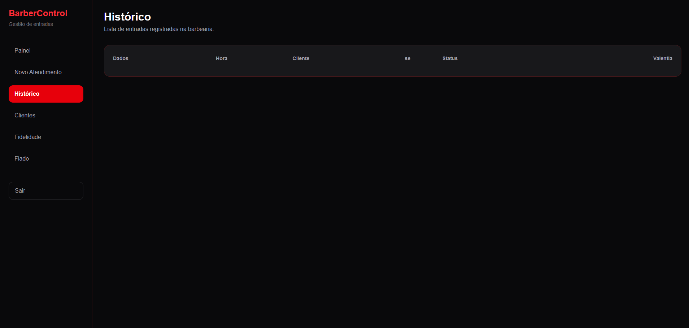
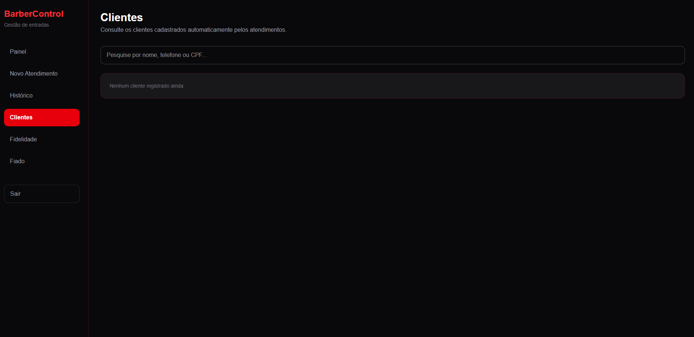
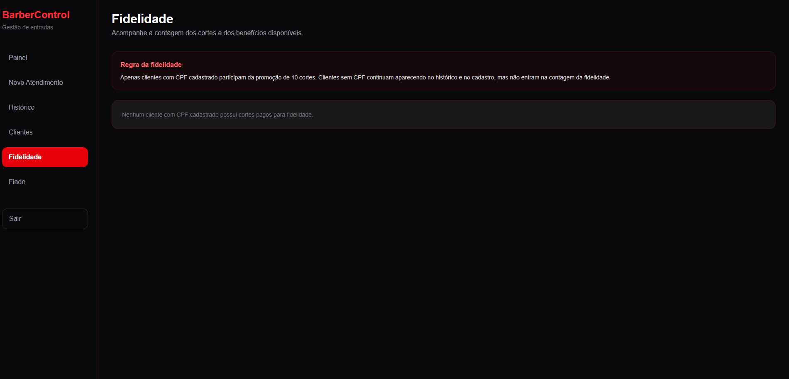
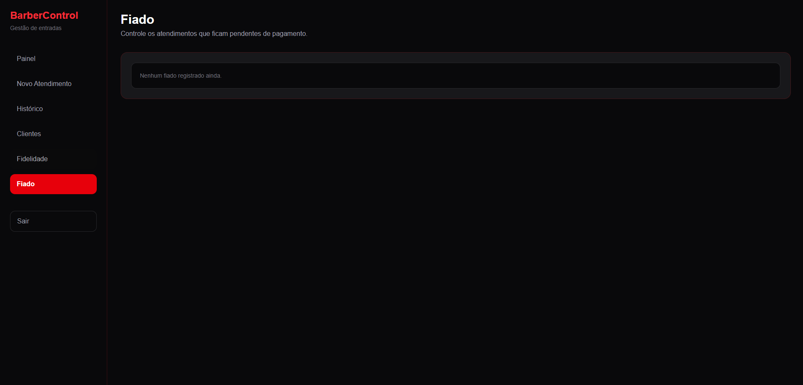

<p align="center">
  
</p>

<h1 align="center">
💈 BarberControl Finance
</h1>

<p align="center">
Sistema de gestão para barbearias desenvolvido com React.
</p>

<p align="center">
Controle de clientes • Atendimentos • Fidelidade • Fiados • Dashboard
</p>

<p align="center">


</p>

---

# 📖 Sobre o projeto

<<<<<<< HEAD
O **BarberControl Finance** é um sistema desenvolvido para auxiliar pequenas barbearias na gestão dos atendimentos e do controle financeiro.
=======


---

## 📖 Sobre o projeto

O **BarberControl Finance** é um sistema desenvolvido para facilitar a gestão de pequenas barbearias.
>>>>>>> e250cbb4af5df6a0de3ea9a62fddb667ff9d7151

A aplicação permite registrar atendimentos, acompanhar o faturamento, controlar pagamentos pendentes (fiados), gerenciar clientes automaticamente e oferecer um programa de fidelidade baseado na quantidade de cortes realizados.

Este projeto foi desenvolvido com o objetivo de colocar em prática conceitos modernos de desenvolvimento Front-end utilizando React, componentização, gerenciamento de estado e organização de aplicações.

Embora atualmente utilize **LocalStorage** para persistência dos dados, sua arquitetura foi planejada para evoluir futuramente para uma solução com autenticação de usuários e banco de dados.

---

# 🌎 Demonstração

### 🚀 Acesse o sistema online

🔗 https://barbercontrolfinance.netlify.app/

---

# ✨ Funcionalidades

- ✅ Dashboard com indicadores financeiros
- ✅ Cadastro de atendimentos
- ✅ Histórico completo dos serviços
- ✅ Cadastro automático de clientes
- ✅ Pesquisa de clientes
- ✅ Programa de fidelidade
- ✅ Controle de pagamentos pendentes (Fiados)
- ✅ Persistência dos dados utilizando LocalStorage
- ✅ Interface responsiva

---

# 🛠 Tecnologias utilizadas

<p align="center">


</p>

<p align="center">

React • JavaScript • Vite • Git • GitHub • LocalStorage

</p>

---

# 📷 Telas do sistema

## 📊 Dashboard


---

## ✂️ Novo Atendimento



---

## 📜 Histórico



---

## 👤 Clientes



---

## 🎁 Fidelidade



---

## 💳 Controle de Fiados



---

## 🚀 Executando o projeto

```bash
# Clone o repositório
git clone https://github.com/KainaFerreira/BarberControl-Finance.git

# Entre na pasta do projeto
cd BarberControl-Finance

# Instale as dependências
npm install

# Inicie o servidor de desenvolvimento
npm run dev
```
---

# 📚 Aprendizados

Durante o desenvolvimento deste projeto foram praticados diversos conceitos importantes do ecossistema React.

- Componentização
- Organização de pastas
- Hooks
- Gerenciamento de estado
- Persistência utilizando LocalStorage
- Estruturação de aplicações React
- Criação de regras de negócio
- Boas práticas de desenvolvimento Front-end
- Desenvolvimento de interfaces responsivas

---

# 🔮 Próximas melhorias

- 🔐 Autenticação de usuários
- ☁️ Integração com Firebase
- 🗄 Banco de Dados
- 👥 Controle de usuários
- 📊 Relatórios Financeiros
- 📅 Agendamento Online
- 📱 Versão Mobile
- 💾 Backup automático

---

# 👨‍💻 Autor

Desenvolvido por **Kainã Ferreira**

🎯 Desenvolvedor Front-end em evolução, apaixonado por tecnologia e por criar soluções para problemas reais.

Atualmente em busca da primeira oportunidade profissional na área de desenvolvimento.

---

<div align="center">

### ⭐ Gostou do projeto?

Se este projeto foi interessante para você, considere deixar uma ⭐ no repositório.

Muito obrigado pela visita!

</div>
